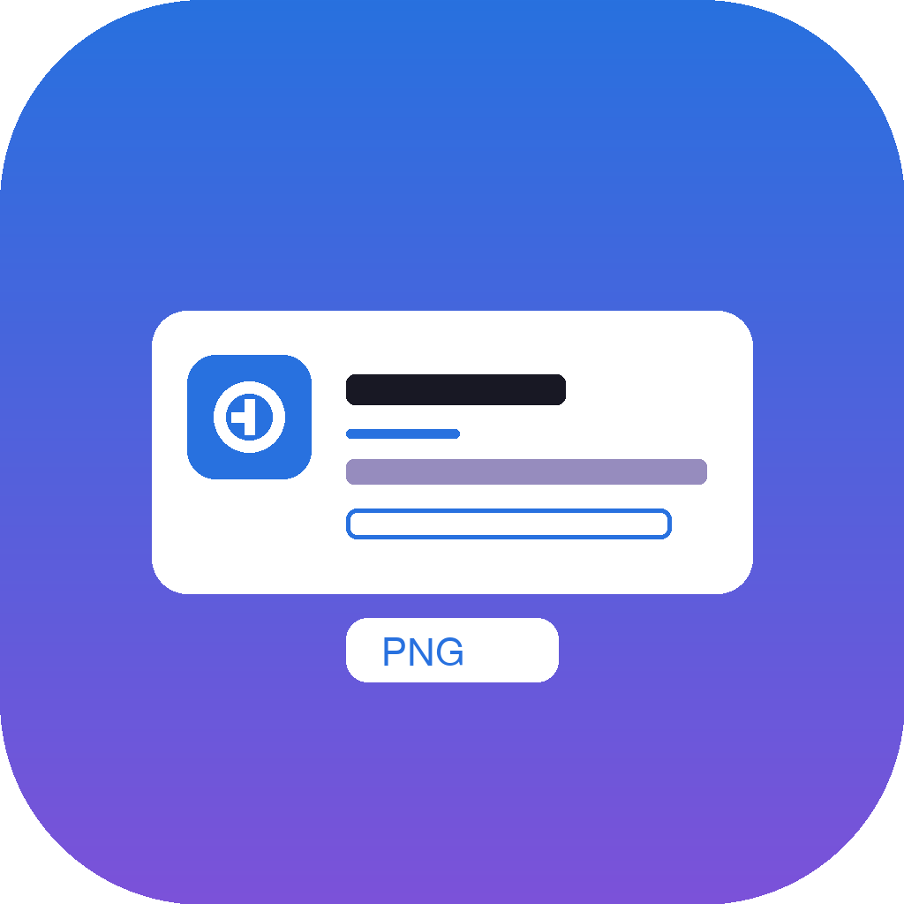

# SocialPreviewMaker / 社交预览图工坊

> 一款 macOS 原生的社交预览图生成工具，离线可用，专注将 App 的 README / 项目信息一键转成 1280×640 社交预览图（类似 GitHub 仓库卡片）。/ A native macOS social-preview image generator. Works offline, focused on turning an App's README / project info into a 1280×640 social preview image (like GitHub repo cards).

> **作者 Author：banqiu**
> **许可证 License：MIT**（详见 LICENSE）。可自由使用、修改与再分发，须保留版权与许可声明。

<p align="center"></p>

[下载最新版 / Download](https://github.com/hwl513782273/SocialPreviewMaker/releases/latest) · [问题反馈 / Issues](https://github.com/hwl513782273/SocialPreviewMaker/issues)

---

## 中文

### 主要功能
- 拖入 App 图标 → 自动采色（从图标提取主色作为强调色 / 背景渐变）。
- 解析 README 双语结构（如 `# 英文 / 中文` 标题），自动填充名称 / 副标题 / 标语 / 功能胶囊。
- 实时预览：标题、副标题、标语、功能胶囊（每行 3 个自动换行）所见即所得。
- 文案与胶囊在「可编辑区全量显示」，画布层按宽度约束截断，保证布局稳定不溢出。
- 一键导出 1280×640 PNG，深色背景、雾蓝描边，开箱即用。
- 原生 SwiftUI / AppKit 单 App，拖入「应用程序」即用，无依赖脚本。

### 快速开始
1. 在 Releases 下载 DMG（见下方「macOS 版本选择」）。
2. 打开 DMG，把 `SocialPreviewMaker.app` 拖入「应用程序」。
3. 首次打开：右键 → 打开（或终端执行 `xattr -dr com.apple.quarantine /Applications/SocialPreviewMaker.app`）。
4. 拖入 App 图标或填写项目信息，点击「导出 PNG」。

从源码构建（需 macOS 12+ 与 Swift 工具链）：
```bash
swiftc -O -target arm64-apple-macosx12.0 -framework AppKit -framework SwiftUI -framework CoreText Sources/*.swift -o SocialPreviewMaker.app/Contents/MacOS/SocialPreviewMaker
codesign --force --deep --sign - SocialPreviewMaker.app
```

打包 DMG：
```bash
hdiutil create -volname "SocialPreviewMaker" -srcfolder "SocialPreviewMaker.app" -ov -format UDZO "12-SocialPreviewMaker-1.4.10-universal.dmg"
```

### macOS 版本选择
- **Apple Silicon 与 Intel Mac（通用）— 推荐**：下载 `12-SocialPreviewMaker-1.4.10-universal.dmg`（同时包含 arm64 + x86_64，macOS 12.0+ 通用）。

> 该 DMG 为 ad-hoc 签名、**未公证（notarized）**，首次打开请右键「打开」放行 Gatekeeper；在 Apple Silicon 上 Intel 部分通过 Rosetta 2 运行。源码零改动。

> 仓库「发行版 / Releases」命名格式：`支持最低版本-SocialPreviewMaker-版本-架构`（如 `12-SocialPreviewMaker-1.4.10-universal.dmg`）。

### 支持的编辑项

| 类别 | 项目 | 说明 |
|---|---|---|
| 基础 | 应用名称 | 大标题，支持自定义字体 |
| 基础 | 副标题 | 名称下方一行说明 |
| 基础 | 标语 | 多行描述，自动换行 |
| 图标 | App 图标 | 拖入 PNG/ICNS，自动采色 |
| 胶囊 | 功能标签 | 每行 3 个自动换行，宽度可调 |
| 配色 | 强调色 / 背景 | 自动采色或手动调整 |

### 差异化亮点
- 🎨 **图标自动采色**：拖入图标即提取主色，背景渐变与描边一键匹配。
- 📐 **双语 README 解析**：识别 `# 英文 / 中文` 结构，自动拆分名称与描述。
- 🖼 **所见即所得**：编辑区全量显示文字，画布按宽度约束不溢出。
- 📦 **零依赖单 App**：纯系统字体，拖入即用，首启无需任何脚本。

---

## English

### Key Features
- Drag in an App icon → auto-extract its dominant color as accent / background gradient.
- Parse bilingual README structure (e.g. `# English / 中文` headings) to auto-fill name / subtitle / tagline / feature pills.
- Live preview: title, subtitle, tagline, and feature pills (3 per row, auto-wrap) — what you see is what you get.
- Text and pills are shown in full in the editor; the canvas truncates by width to keep layout stable without overflow.
- One-click export to 1280×640 PNG with dark background and mist-blue stroke. Zero dependencies.
- Native SwiftUI / AppKit single App — drag into Applications and use immediately, no setup scripts.

### Quick start
1. Download the DMG from Releases (see "Choose a macOS build" below).
2. Open the DMG and drag `SocialPreviewMaker.app` into Applications.
3. First launch: right-click → Open (or run `xattr -dr com.apple.quarantine /Applications/SocialPreviewMaker.app` in Terminal).
4. Drop an App icon or fill in project info, then click "Export PNG".

Build from source (requires macOS 12+ and the Swift toolchain):
```bash
swiftc -O -target arm64-apple-macosx12.0 -framework AppKit -framework SwiftUI -framework CoreText Sources/*.swift -o SocialPreviewMaker.app/Contents/MacOS/SocialPreviewMaker
codesign --force --deep --sign - SocialPreviewMaker.app
```

Build the DMG:
```bash
hdiutil create -volname "SocialPreviewMaker" -srcfolder "SocialPreviewMaker.app" -ov -format UDZO "12-SocialPreviewMaker-1.4.10-universal.dmg"
```

### Choose a macOS build
- **Apple Silicon & Intel Mac (universal) — recommended**: use `12-SocialPreviewMaker-1.4.10-universal.dmg` (contains both arm64 + x86_64, universal, macOS 12.0+).

> Ad-hoc signed and **not notarized**; right-click "Open" on first launch to bypass Gatekeeper. The Intel part runs on Apple Silicon via Rosetta 2. Zero source changes.

> Release asset naming: `min-version-SocialPreviewMaker-version-arch` (e.g. `12-SocialPreviewMaker-1.4.10-universal.dmg`).

### Supported editing items

| Category | Item | Notes |
|---|---|---|
| Base | App name | Large title, custom font |
| Base | Subtitle | One-line below name |
| Base | Tagline | Multi-line, auto-wrapped |
| Icon | App icon | Drop PNG/ICNS, auto color |
| Pills | Feature tags | 3 per row, auto-wrap, adjustable width |
| Color | Accent / Background | Auto from icon or manual |

### Highlights
- 🎨 **Auto color from icon**: drop an icon and extract its dominant color for background gradient and stroke.
- 📐 **Bilingual README parsing**: detects `# English / 中文` structure, auto-splits name and description.
- 🖼 **WYSIWYG**: editor shows full text; canvas truncates by width to avoid overflow.
- 📦 **Zero-dependency single App**: pure system fonts, drag-and-use, no scripts on first launch.

---

## 支持 / Support

SocialPreviewMaker 是一款免费开源工具，基于 MIT 许可发布，离线、无广告。如果你觉得好用，欢迎在 GitHub 上点个 Star，或反馈问题 / 提交 PR 帮它变得更好 —— 纯自愿。 This tool is free, open-source, and ad-free. If it helps you, a GitHub Star or an issue/PR is warmly welcome — entirely optional.
